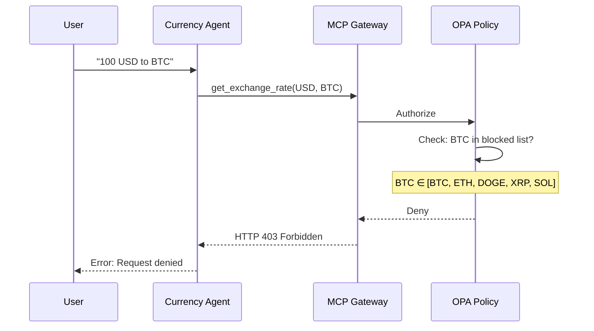

# Step 04: Test Blocked Request

**Time**: 10 minutes

## What You'll Do

Test that cryptocurrency conversions (BTC, ETH, DOGE) are blocked by the OPA policy.

## The Test

Try to convert USD to Bitcoin:

```
What is 100 USD in BTC?
```

Expected result: **Blocked** 

## Option A: ADK Web UI

1. Open `https://<adk-route>/dev-ui/`
2. Select **currency_agent**
3. Type: **"What is 100 USD in BTC?"**

Expected response:
- Error message indicating the request was denied
- Or a policy violation message

## Option B: Direct API Call

```bash
# Port forward (if not already)
oc port-forward svc/currency-agent 8000:8000 -n agent-sandbox

# Test blocked request
curl -X POST http://localhost:8000/v1/chat \
  -H "Content-Type: application/json" \
  -d '{
    "messages": [
      {"role": "user", "content": "What is 100 USD in BTC?"}
    ]
  }'
```

## What's Happening



## Test All Blocked Currencies

| Request | Expected |
|---------|----------|
| "100 USD to BTC" |  Blocked |
| "100 USD to ETH" |  Blocked |
| "100 USD to DOGE" |  Blocked |
| "Convert BTC to USD" |  Blocked |
| "What's 1 ETH in EUR?" |  Blocked |

## Verify the Policy

Check the AuthPolicy that's blocking these requests:

```bash
oc get authpolicy -n mcp-test -o yaml
```

Look for the Rego policy:

```rego
deny if {
  input.context.request.http.body.params.arguments.currency_to in ["BTC", "ETH", "DOGE", "XRP", "SOL"]
}

deny if {
  input.context.request.http.body.params.arguments.currency_from in ["BTC", "ETH", "DOGE", "XRP", "SOL"]
}
```

## Check Authorino Logs (Advanced)

To see the policy decision:

```bash
# Find Authorino pod
oc get pods -n kuadrant-system -l app=authorino

# Check logs for denials
oc logs -n kuadrant-system -l app=authorino --tail=50 | grep -i deny
```

## Layers in Action

For this blocked request:

| Layer | Status | Why |
|-------|--------|-----|
| **Layer 1 (Kata)** |  Active | Agent runs in VM |
| **Layer 2 (Egress)** | N/A | Request never reaches external API |
| **Layer 3 (Policy)** |  **Blocked** | BTC is in denied currency list |

## Why This Matters

The policy blocked the request **before** it could:
- Call the external API
- Process potentially sensitive data
- Execute an unauthorized action

This is **proactive security** - the bad request never executes.

## Compare: Allowed vs Blocked

| Request | Layer 1 | Layer 2 | Layer 3 | Result |
|---------|---------|---------|---------|--------|
| "USD to EUR" |  Kata |  Egress |  Policy |  Success |
| "USD to BTC" |  Kata | N/A |  Policy |  Blocked |

## Test Egress Control (Optional)

To verify Layer 2 (egress) is also working, you can test from inside the agent namespace:

```bash
# Create a test pod
oc run test-egress -n agent-sandbox --rm -it --restart=Never \
  --image=curlimages/curl -- sh

# Inside the pod, test allowed host
curl -I https://api.frankfurter.app/latest --max-time 5
# Should return HTTP 200

# Test blocked host
curl -I https://api.openai.com --max-time 5
# Should timeout or return error (blocked by Istio)
```

## Checkpoint

You've verified:

- [ ] BTC conversion is blocked
- [ ] ETH conversion is blocked
- [ ] Policy decision happens before API call
- [ ] Allowed currencies still work

## Next Step

👉 [Step 05: Observe Traces](05-observe-traces.md)

