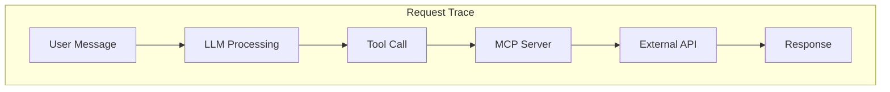

# Step 05: Observe Traces

**Time**: 5 minutes

## What You'll Do

Use observability tools to see the agent's execution traces and understand what happened during your tests.

---

## Observability Options

| Tool | What It Shows | How to Access |
|------|---------------|---------------|
| **Phoenix** | LLM traces, tool calls | Kagenti includes Phoenix |
| **Agent Logs** | Request processing | `oc logs` |
| **Kiali** | Service mesh traffic | OpenShift Service Mesh |

---

## Option A: Agent Logs

View the agent's container logs:

```bash
# Stream logs
oc logs -n currency-kagenti deployment/currency-agent -f

# Last 100 lines
oc logs -n currency-kagenti deployment/currency-agent --tail=100
```

Look for:
- Incoming requests
- Tool invocations (MCP calls)
- API responses
- Errors

---

## Option B: Phoenix Dashboard

If Phoenix is deployed with Kagenti:

### 1. Get Phoenix URL

```bash
oc get route phoenix -n kagenti-system -o jsonpath='https://{.spec.host}'
```

Or port-forward:

```bash
oc port-forward svc/phoenix -n kagenti-system 6006:6006
# Open http://localhost:6006
```

### 2. Explore the Dashboard

- **Traces**: Individual request traces
- **Spans**: Breakdown of each step
- **LLM Calls**: View prompts and completions

---

## Understanding Request Flow

### Successful Request Trace

```
📥 User: "What is 100 USD in EUR?"
   │
   ├─ 🤖 LLM: Parse intent
   │     └─ Decided to call: get_exchange_rate
   │
   ├─ 🔧 Tool: get_exchange_rate(USD, EUR, 100)
   │     ├─ MCP Server: currency-mcp-server
   │     ├─ API call: api.frankfurter.app
   │     └─ Result: {rate: 0.9245, converted: 92.45}
   │
   └─ 💬 Response: "100 USD is 92.45 EUR"
```

### Trace Visualization



---

## Check MCP Server Logs

```bash
# MCP server logs
oc logs -n currency-kagenti deployment/currency-mcp-server --tail=50
```

Look for:
- Incoming tool calls
- Rate API responses
- Any errors

---

## Verification Summary

```bash
echo "=== Observability Check ===" && \
echo "" && \
echo "1. Agent logs available:" && \
oc logs -n currency-kagenti deployment/currency-agent --tail=5 && \
echo "" && \
echo "2. MCP server logs available:" && \
oc logs -n currency-kagenti deployment/currency-mcp-server --tail=5 && \
echo "" && \
echo "3. Phoenix route:" && \
oc get route phoenix -n kagenti-system -o jsonpath='https://{.spec.host}' 2>/dev/null || echo "   Not exposed"
```

---

## Module Complete! 🎉

You've completed the Deploy & Test module:

- ✅ Built agent from source using AgentBuild
- ✅ Deployed with Kata VM isolation
- ✅ Tested currency conversions
- ✅ Explored execution traces

---

## What's Next?

Your agent is deployed and working. Now add security hardening:

| Next Step | Description |
|-----------|-------------|
| [Module 05: Security Hardening](../05-security-hardening/index.md) | Add egress control and tool policies |

After security hardening, you'll have all three protection layers active:

| Layer | Status |
|-------|--------|
| **Layer 1: VM Isolation** | ✅ Configured (Kata) |
| **Layer 2: Network Egress** | ⏳ Configure in Module 05 |
| **Layer 3: Tool Policy** | ⏳ Configure in Module 05 |

---

👉 [Continue to Module 05: Security Hardening](../05-security-hardening/index.md)
