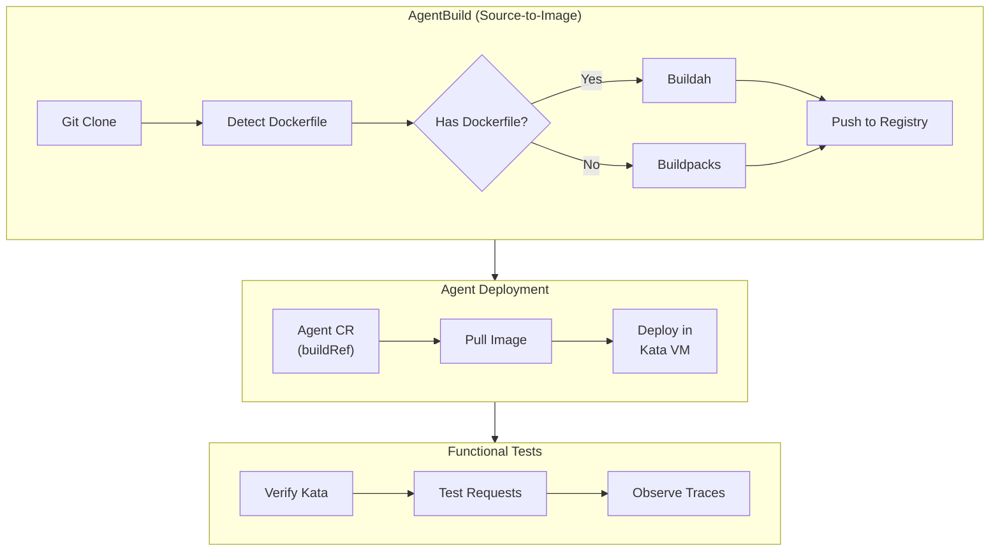

# Module 04: Deploy & Test

**Duration**: 30 minutes  
**Persona**: 🚀 Agent Developer

## Overview

In this module, you'll deploy the Currency Agent to OpenShift using the **Kagenti AgentBuild** approach and verify it works. After confirming basic functionality, you can add security hardening in Module 05.

## What You'll Learn

- How AgentBuild automates container builds from Git
- How Agent CR references builds via `buildRef`
- How Kata VM provides workload isolation
- How to test the agent with real requests

---

## Steps

| Step | Description | Time |
|------|-------------|------|
| [01 - Deploy Agent](01-deploy-agent.md) | Create AgentBuild and Agent CRs | 10 min |
| [02 - Verify VM Isolation](02-verify-kata.md) | Confirm agent runs in Kata VM | 5 min |
| [03 - Test Requests](03-test-allowed.md) | Test currency conversion | 10 min |
| [05 - Observe Traces](05-observe-traces.md) | View execution in Phoenix | 5 min |

---

## What You're Building



---

## Prerequisites

Before starting, ensure:

- [ ] Module 02 completed (platform configured) with pipeline setup
- [ ] `oc` CLI installed and logged in
- [ ] Registry credentials configured (quay.io or internal)
- [ ] GitHub token secret created
- [ ] Gemini API key

Verify access:

```bash
# Check logged in
oc whoami

# Check namespace exists
oc get namespace agent-sandbox

# Check AgentBuild CRD available
oc get crd agentbuilds.agent.kagenti.dev
```

---

## The Deployment Flow

```
┌─────────────────────────────────────────────────────────────────────────┐
│                    AgentBuild Deployment Flow                            │
├─────────────────────────────────────────────────────────────────────────┤
│                                                                         │
│  1. Create AgentBuild CR                                                │
│        ↓                                                                │
│  2. Kagenti creates PipelineRun                                         │
│        ↓                                                                │
│  3. Tekton clones code, builds image                                    │
│        ↓                                                                │
│  4. Image pushed to registry                                            │
│        ↓                                                                │
│  5. Create Agent CR (references AgentBuild)                             │
│        ↓                                                                │
│  6. Kagenti creates Deployment with Kata runtime                        │
│        ↓                                                                │
│  7. Agent pod starts in micro-VM                                        │
│                                                                         │
└─────────────────────────────────────────────────────────────────────────┘
```

---

## What You'll Deploy

| Component | Type | Purpose |
|-----------|------|---------|
| **MCP Server AgentBuild** | `AgentBuild` | Build MCP server image |
| **MCP Server Deployment** | `Deployment` | Run the currency tool |
| **Agent AgentBuild** | `AgentBuild` | Build agent image |
| **Agent CR** | `Agent` | Deploy agent with Kata |

---

## Kata VM Isolation

Every agent pod runs in a lightweight VM:

```
┌─────────────────────────────────────────────────────────────────────────┐
│                         Worker Node                                      │
├─────────────────────────────────────────────────────────────────────────┤
│                                                                         │
│  ┌─────────────────────────────────┐                                    │
│  │   Kata VM (micro-VM)            │                                    │
│  │                                 │                                    │
│  │   ┌─────────────────────────┐  │                                    │
│  │   │   Agent Container       │  │                                    │
│  │   │   (Currency Agent)      │  │                                    │
│  │   └─────────────────────────┘  │                                    │
│  │                                 │                                    │
│  │   Guest Kernel                  │  ← Separate kernel                │
│  └─────────────────────────────────┘                                    │
│                                                                         │
│  Host Kernel                                                            │
└─────────────────────────────────────────────────────────────────────────┘
```

---

## After This Module

Once you've deployed and tested the agent, proceed to security hardening:

| Next Module | Description |
|-------------|-------------|
| [Module 05: Security Hardening](../05-security-hardening/index.md) | Add egress control and tool policies |

Security hardening adds:
- **Egress Control**: Limit which external APIs the agent can call
- **Tool Policies**: Block specific operations (e.g., cryptocurrency)

---

## Let's Begin

👉 [Step 01: Deploy the Agent](01-deploy-agent.md)
