# Step 02: Configure Egress Control

**Time**: 5 minutes  
**Persona**: 👷 Platform Admin

## What You'll Do

Create an Istio `ServiceEntry` to define which external APIs the agent can reach.

---

## How Istio Egress Works

With Istio in `REGISTRY_ONLY` mode, **all external traffic is blocked by default**. You must explicitly allow each external host.

```
┌─────────────────────────────────────────────────────────────────────────┐
│                    Istio Egress Control                                  │
├─────────────────────────────────────────────────────────────────────────┤
│                                                                         │
│  Agent Pod                                                              │
│    ↓                                                                    │
│  Istio Sidecar (envoy proxy)                                            │
│    ↓                                                                    │
│  Check: Is destination in ServiceEntry?                                 │
│    ├── YES → Allow connection                                           │
│    └── NO  → Block connection (connection refused)                      │
│                                                                         │
└─────────────────────────────────────────────────────────────────────────┘
```

---

## Step 1: Check Current State

First, verify the namespace has Istio sidecar injection enabled:

```bash
oc get namespace currency-kagenti -o yaml | grep istio
```

If not labeled:
```bash
oc label namespace currency-kagenti istio-injection=enabled
```

---

## Step 2: Create ServiceEntry

The Currency Agent needs to reach:

| API | Purpose |
|-----|---------|
| `api.frankfurter.app` | Currency exchange rates |
| `generativelanguage.googleapis.com` | Gemini LLM |

```bash
cat <<'EOF' | oc apply -f -
apiVersion: networking.istio.io/v1beta1
kind: ServiceEntry
metadata:
  name: allowed-external-apis
  namespace: currency-kagenti
spec:
  hosts:
    - api.frankfurter.app
    - generativelanguage.googleapis.com
  ports:
    - number: 443
      name: https
      protocol: HTTPS
  resolution: DNS
  location: MESH_EXTERNAL
EOF
```

---

## Step 3: Verify ServiceEntry

```bash
oc get serviceentry -n currency-kagenti
```

Expected output:
```
NAME                    HOSTS                                                     LOCATION        RESOLUTION
allowed-external-apis   ["api.frankfurter.app","generativelanguage.googleapis.com"]   MESH_EXTERNAL   DNS
```

---

## Step 4: Restart Agent Pod (for Sidecar)

If the agent was deployed before Istio injection was enabled:

```bash
# Restart to pick up sidecar
oc rollout restart deployment currency-agent -n currency-kagenti
```

Verify sidecar is injected:
```bash
oc get pod -n currency-kagenti -l app.kubernetes.io/name=currency-agent -o jsonpath='{.items[0].spec.containers[*].name}'
```

Expected: `agent istio-proxy` (two containers)

---

## Understanding ServiceEntry

```yaml
apiVersion: networking.istio.io/v1beta1
kind: ServiceEntry
metadata:
  name: allowed-external-apis
  namespace: currency-kagenti     # Scoped to this namespace
spec:
  hosts:
    - api.frankfurter.app         # Allowed host 1
    - generativelanguage.googleapis.com  # Allowed host 2
  ports:
    - number: 443
      name: https
      protocol: HTTPS             # HTTPS on port 443
  resolution: DNS                 # Resolve via DNS
  location: MESH_EXTERNAL         # External to the mesh
```

| Field | Purpose |
|-------|---------|
| `hosts` | List of allowed external hostnames |
| `ports` | Port and protocol configuration |
| `resolution` | How to resolve the hostname (`DNS`, `STATIC`) |
| `location` | `MESH_EXTERNAL` for external services |

---

## What Gets Blocked

| Destination | In ServiceEntry? | Result |
|-------------|------------------|--------|
| `api.frankfurter.app` | ✓ Yes | Allowed |
| `generativelanguage.googleapis.com` | ✓ Yes | Allowed |
| `api.openai.com` | ✗ No | Blocked |
| `evil.com` | ✗ No | Blocked |
| `internal-service.other-ns.svc` | N/A | Allowed (in-mesh) |

---

## Architecture

```mermaid
flowchart LR
    subgraph Namespace["currency-kagenti"]
        Agent["Agent Pod"]
        Sidecar["Istio Sidecar"]
    end
    
    subgraph External["External APIs"]
        FX["✓ api.frankfurter.app"]
        Gemini["✓ googleapis.com"]
        OpenAI["✗ api.openai.com"]
        Evil["✗ evil.com"]
    end
    
    Agent --> Sidecar
    Sidecar -->|"In ServiceEntry"| FX
    Sidecar -->|"In ServiceEntry"| Gemini
    Sidecar -.->|"Blocked"| OpenAI
    Sidecar -.->|"Blocked"| Evil
```



---

## Troubleshooting

### Agent Can't Reach Allowed API

```bash
# Check ServiceEntry is applied
oc get serviceentry -n currency-kagenti

# Check pod has sidecar
oc get pod -n currency-kagenti -l app.kubernetes.io/name=currency-agent -o yaml | grep -A5 containers:

# Check Istio proxy logs
oc logs -n currency-kagenti -l app.kubernetes.io/name=currency-agent -c istio-proxy --tail=50
```

### Need to Allow Additional API

Add more hosts to the ServiceEntry:

```bash
oc patch serviceentry allowed-external-apis -n currency-kagenti --type=json \
  -p='[{"op": "add", "path": "/spec/hosts/-", "value": "new-api.example.com"}]'
```

---

## Next Step

Now let's test that egress control is working.

👉 [Step 03: Test Egress](03-test-egress.md)

