# Step 04: Configure Tool Policy

**Time**: 5 minutes  
**Persona**: 👷 Platform Admin

## What You'll Do

Deploy an OPA (Open Policy Agent) policy that inspects tool calls and blocks unauthorized operations.

---

## How Tool Policy Works

The MCP Gateway routes tool calls through Kuadrant's Authorino, which evaluates OPA policies:

```
┌─────────────────────────────────────────────────────────────────────────┐
│                    Tool Call Flow                                        │
├─────────────────────────────────────────────────────────────────────────┤
│                                                                         │
│  Agent                                                                  │
│    ↓ tools/call(get_exchange_rate, {from: "USD", to: "BTC"})           │
│  MCP Gateway                                                            │
│    ↓                                                                    │
│  Authorino (OPA)                                                        │
│    ↓ Evaluate policy: Is "BTC" in blocked list?                        │
│    ├── NO  → Forward to MCP Server                                      │
│    └── YES → Return 403 Forbidden                                       │
│                                                                         │
└─────────────────────────────────────────────────────────────────────────┘
```

---

## Step 1: Create HTTPRoute for MCP Server

First, route traffic through the MCP Gateway:

```bash
cat <<'EOF' | oc apply -f -
apiVersion: gateway.networking.k8s.io/v1
kind: HTTPRoute
metadata:
  name: currency-mcp-route
  namespace: currency-kagenti
spec:
  parentRefs:
    - name: mcp-gateway
      namespace: kagenti-system
  hostnames:
    - "currency-mcp.apps.example.com"  # Replace with your cluster domain
  rules:
    - matches:
        - path:
            type: PathPrefix
            value: /
      backendRefs:
        - name: currency-mcp-server
          port: 8080
EOF
```

!!! tip "Get Your Cluster Domain"
    ```bash
    DOMAIN=$(oc get ingresses.config cluster -o jsonpath='{.spec.domain}')
    echo "Use: currency-mcp.$DOMAIN"
    ```

---

## Step 2: Create AuthPolicy

Deploy the OPA policy that blocks cryptocurrency:

```bash
cat <<'EOF' | oc apply -f -
apiVersion: kuadrant.io/v1beta2
kind: AuthPolicy
metadata:
  name: block-crypto-policy
  namespace: currency-kagenti
spec:
  targetRef:
    group: gateway.networking.k8s.io
    kind: HTTPRoute
    name: currency-mcp-route
  rules:
    authorization:
      opa:
        allValues: true
        rego: |
          package currency_policy
          
          import future.keywords.if
          import future.keywords.in
          
          # Default: allow all requests
          default allow := true
          
          # List of blocked cryptocurrencies
          blocked_currencies := ["BTC", "ETH", "DOGE", "XRP", "SOL", "ADA", "DOT", "MATIC"]
          
          # Block if source currency is crypto
          deny if {
            input.context.request.http.body.params.arguments.currency_from in blocked_currencies
          }
          
          # Block if target currency is crypto
          deny if {
            input.context.request.http.body.params.arguments.currency_to in blocked_currencies
          }
          
          # Allow only if not denied
          allow if {
            not deny
          }
EOF
```

---

## Step 3: Verify AuthPolicy

```bash
oc get authpolicy -n currency-kagenti
```

Expected:
```
NAME                  AGE
block-crypto-policy   10s
```

Check the policy is accepted:

```bash
oc describe authpolicy block-crypto-policy -n currency-kagenti | grep -A5 "Status:"
```

---

## Understanding the Policy

### Policy Structure

```yaml
apiVersion: kuadrant.io/v1beta2
kind: AuthPolicy
metadata:
  name: block-crypto-policy
spec:
  targetRef:
    kind: HTTPRoute
    name: currency-mcp-route    # Apply to this route
  rules:
    authorization:
      opa:
        rego: |
          # OPA Rego policy code
```

### Rego Policy Logic

```rego
package currency_policy

# Blocked currencies list
blocked_currencies := ["BTC", "ETH", "DOGE", "XRP", "SOL", "ADA", "DOT", "MATIC"]

# Block if source is crypto
deny if {
  input.context.request.http.body.params.arguments.currency_from in blocked_currencies
}

# Block if target is crypto
deny if {
  input.context.request.http.body.params.arguments.currency_to in blocked_currencies
}
```

| Rule | What It Does |
|------|--------------|
| `blocked_currencies` | List of crypto symbols to block |
| `deny if currency_from in blocked` | Blocks "100 BTC to USD" |
| `deny if currency_to in blocked` | Blocks "100 USD to BTC" |

---

## Policy Decision Matrix

| Request | currency_from | currency_to | Decision |
|---------|---------------|-------------|----------|
| "100 USD to EUR" | USD | EUR | ✓ Allow |
| "100 USD to BTC" | USD | BTC | ✗ Deny |
| "100 BTC to USD" | BTC | USD | ✗ Deny |
| "50 GBP to JPY" | GBP | JPY | ✓ Allow |
| "1 ETH to EUR" | ETH | EUR | ✗ Deny |

---

## Architecture

```mermaid
sequenceDiagram
    participant Agent
    participant Gateway as MCP Gateway
    participant OPA as Authorino + OPA
    participant MCP as MCP Server
    
    Note over Agent,MCP: Request: USD → BTC (Blocked)
    Agent->>Gateway: tools/call(get_exchange_rate, USD, BTC)
    Gateway->>OPA: Authorize request
    OPA->>OPA: Check: BTC in blocked list? YES
    OPA-->>Gateway: ✗ Deny
    Gateway-->>Agent: HTTP 403 Forbidden
    
    Note over Agent,MCP: Request: USD → EUR (Allowed)
    Agent->>Gateway: tools/call(get_exchange_rate, USD, EUR)
    Gateway->>OPA: Authorize request
    OPA->>OPA: Check: EUR in blocked list? NO
    OPA-->>Gateway: ✓ Allow
    Gateway->>MCP: Forward request
    MCP-->>Agent: Exchange rate result
```



---

## Extending the Policy

### Add More Blocked Currencies

```rego
blocked_currencies := ["BTC", "ETH", "DOGE", "XRP", "SOL", "ADA", "DOT", "MATIC", "SHIB", "AVAX"]
```

### Block by Amount Threshold

```rego
# Block large transactions
deny if {
  to_number(input.context.request.http.body.params.arguments.amount) > 10000
}
```

### Block by Time of Day

```rego
# Block after hours (crude example)
deny if {
  time.hour(time.now_ns()) >= 18  # After 6 PM
}
```

---

## Troubleshooting

### AuthPolicy Not Applied

```bash
# Check Kuadrant is running
oc get pods -n kuadrant-system | grep authorino

# Check policy status
oc describe authpolicy block-crypto-policy -n currency-kagenti
```

### Policy Not Blocking

```bash
# Verify HTTPRoute is targeted
oc get httproute currency-mcp-route -n currency-kagenti

# Check Authorino logs
oc logs -n kuadrant-system -l app=authorino --tail=50
```

---

## Next Step

Now let's test that the policy is working.

👉 [Step 05: Test Policy](05-test-policy.md)

