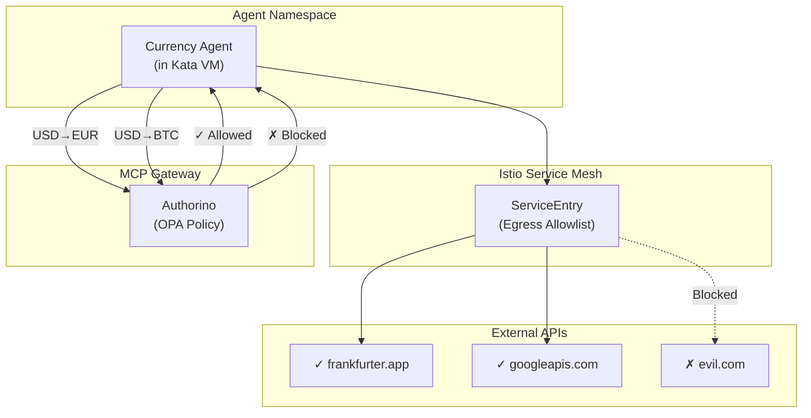

# Module 05: Security Hardening

**Duration**: 20 minutes  
**Persona**: 👷 Platform Admin

## Overview

Now that your agent is deployed and running, it's time to add **security hardening**. This module adds two critical layers:

1. **Network Egress Control** - Limit which external APIs the agent can call
2. **Tool Policy Enforcement** - Block specific tool operations (e.g., cryptocurrency)

---

## Why Harden After Deployment?

You've already seen the agent work. Now you'll understand:

| Without Hardening | With Hardening |
|-------------------|----------------|
| Agent can call ANY external API | Agent can only call approved APIs |
| All tool operations allowed | Dangerous operations blocked |
| No visibility into policy violations | All violations logged for audit |

This approach helps you:

1. **Understand the baseline** - See what the agent does without restrictions
2. **Apply targeted controls** - Know exactly what you're restricting
3. **Verify the difference** - Test before and after to confirm security

---

## The Three Security Layers

```
┌─────────────────────────────────────────────────────────────────────────┐
│                    AI Agent Security Model                               │
├─────────────────────────────────────────────────────────────────────────┤
│                                                                         │
│  Layer 1: VM Isolation (Kata)                    ✓ Already Configured   │
│  ─────────────────────────────────────────────────────────────────      │
│  Agent runs in micro-VM with own kernel                                 │
│                                                                         │
│  Layer 2: Network Egress (Istio)                 ← This Module          │
│  ─────────────────────────────────────────────────────────────────      │
│  Only approved external APIs reachable                                  │
│                                                                         │
│  Layer 3: Tool Policy (OPA)                      ← This Module          │
│  ─────────────────────────────────────────────────────────────────      │
│  Specific tool operations blocked by policy                             │
│                                                                         │
└─────────────────────────────────────────────────────────────────────────┘
```

---

## Steps

| Step | Description | Time |
|------|-------------|------|
| [01 - Understand Threats](01-understand-threats.md) | Learn what you're protecting against | 3 min |
| [02 - Configure Egress](02-configure-egress.md) | Limit external API access | 5 min |
| [03 - Test Egress](03-test-egress.md) | Verify blocked/allowed traffic | 5 min |
| [04 - Configure Policy](04-configure-policy.md) | Deploy OPA tool policy | 5 min |
| [05 - Test Policy](05-test-policy.md) | Verify blocked operations | 5 min |

---

## Prerequisites

Before starting, ensure:

- [ ] Agent deployed and running (Module 04 completed)
- [ ] Agent tested with basic requests (confirmed working)
- [ ] Istio installed (from prerequisites)
- [ ] Kuadrant installed (from prerequisites)

Verify:

```bash
# Agent is running
oc get pods -n currency-kagenti | grep currency-agent

# Istio is installed
oc get pods -n istio-system | grep istiod

# Kuadrant is installed
oc get pods -n kuadrant-system | grep authorino
```

---

## What You'll Configure

### Network Egress (Istio ServiceEntry)

```yaml
apiVersion: networking.istio.io/v1beta1
kind: ServiceEntry
metadata:
  name: allowed-apis
spec:
  hosts:
    - api.frankfurter.app    # Currency API - allowed
    - generativelanguage.googleapis.com  # Gemini API - allowed
  # Everything else is BLOCKED by default
```

### Tool Policy (OPA via Kuadrant)

```yaml
apiVersion: kuadrant.io/v1beta2
kind: AuthPolicy
metadata:
  name: block-crypto
spec:
  rules:
    authorization:
      opa:
        rego: |
          # Block cryptocurrency conversions
          deny if input.currency_from in ["BTC", "ETH"]
          deny if input.currency_to in ["BTC", "ETH"]
```

---

## Architecture After Hardening



---

## Let's Begin

👉 [Step 01: Understand Threats](01-understand-threats.md)

