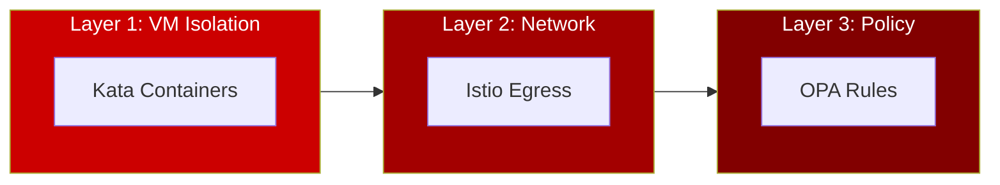
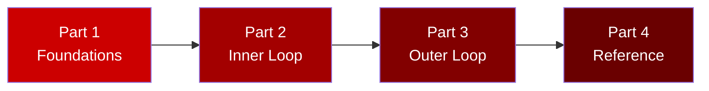

# AI Agent Sandbox on OpenShift

A hands-on workshop for securing AI agents with VM isolation, network control, and policy enforcement.

**Duration**: ~2 hours  
**Level**: Intermediate

---

## What You'll Build

A **Currency Conversion Agent** that:

- ✅ Converts between fiat currencies (USD, EUR, GBP, JPY)
- ❌ Is blocked from cryptocurrency conversions (BTC, ETH, DOGE)
- 🔒 Runs in an isolated VM (Kata Containers)
- 🌐 Can only reach approved external APIs

---

## The Three Layers of Protection



| Layer | Technology | What It Protects Against |
|-------|------------|--------------------------|
| **1. VM Isolation** | OpenShift Sandboxed Containers | Container escapes, kernel exploits |
| **2. Network Egress** | Istio ServiceEntry | Data exfiltration, unauthorized APIs |
| **3. Tool Policy** | Kuadrant + OPA | Unauthorized tool usage, crypto conversion |

---

## Workshop Structure



---

## Parts Overview

### [Part 1: Foundations](01-foundations/index.md)
**👥 Everyone** • 30 minutes

Understand the concepts before building:

- Why AI agents need special security
- The three-layer defense model
- Agent Development Lifecycle (ADLC)
- Technology stack overview

---

### [Part 2: Inner Loop](02-inner-loop/index.md)
**👩‍💻 Developer** • 30 minutes

Develop and test rapidly using the ADK Web UI on the cluster:

- Understand the agent code
- Test in ADK Web UI (already deployed)
- Iterate and refine

---

### [Part 3: Outer Loop](03-outer-loop/index.md)
**👷 Platform Admin + 👩‍💻 Developer** • 60 minutes

Build, deploy, and secure the agent:

- Platform Setup (Admin)
- Build with AgentBuild (Developer)
- Deploy Agent in Kata VM (Developer)
- Security Hardening (Admin)
- Monitor & Tune (Both)

---

### [Part 4: Reference](04-reference/index.md)
**📚 Reference**

- Manifest guide
- Troubleshooting
- Cleanup

---

## Who Should Do What?

| Your Role | Part 1 | Part 2 | Part 3 | Part 4 |
|-----------|--------|--------|--------|--------|
| **Solo Learner** | ✅ Do All | ✅ Do All | ✅ Do All | 📚 Ref |
| **Platform Admin** | ✅ Do All | 📖 Read | ✅ Setup + Security | 📚 Ref |
| **Agent Developer** | ✅ Do All | ✅ Do All | ✅ Build + Deploy | 📚 Ref |

---

## Prerequisites

- OpenShift 4.14+ cluster with admin access
- Kagenti, Kuadrant, and OSC operators installed
- `oc` CLI installed and logged in
- Gemini API key ([Get one here](https://aistudio.google.com/app/apikey))

### Verify Prerequisites

```bash
# Check operators
oc get csv -n openshift-sandboxed-containers-operator | grep Succeeded
oc get pods -n kagenti-system | grep kagenti-controller

# Check ADK Web UI (for inner loop)
oc get route adk-server -n adk-web
```

---

## Let's Get Started

👉 [Start with Part 1: Foundations](01-foundations/index.md)

Or if you already understand the concepts:

👉 [Skip to Part 2: Inner Loop](02-inner-loop/index.md)
