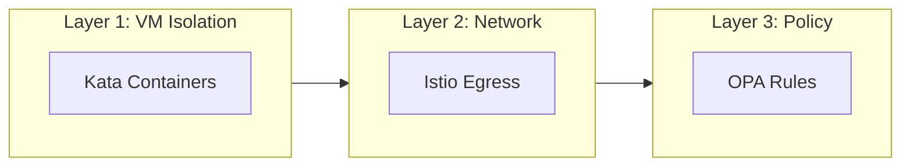
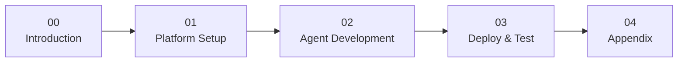

# AI Agent Sandbox on OpenShift

A hands-on workshop for securing AI agents with VM isolation, network control, and policy enforcement.

**Duration**: ~2 hours  
**Level**: Intermediate

## What You'll Build

A **Currency Conversion Agent** that:

- ✅ Converts between fiat currencies (USD, EUR, GBP, JPY)
- ❌ Is blocked from cryptocurrency conversions (BTC, ETH, DOGE)
- 🔒 Runs in an isolated VM (Kata Containers)
- 🌐 Can only reach approved external APIs

## The Three Layers of Protection

| Layer | Technology | What It Protects Against |
|-------|------------|--------------------------|
| **1. VM Isolation** | OpenShift Sandboxed Containers | Container escapes, kernel exploits |
| **2. Network Egress** | Istio ServiceEntry | Data exfiltration, unauthorized APIs |
| **3. Tool Policy** | Kuadrant + OPA | Unauthorized tool usage, crypto conversion |

---

## Workshop Flow

This workshop follows a logical order. **Everyone reads all modules** to understand the full picture, but each module indicates who performs the hands-on steps.

---

## Modules

### [Module 00: Introduction](00-introduction/index.md)
**👥 Everyone** • 15 minutes

Understand the security challenges with AI agents and the three-layer defense model.

- Why AI agents need special security
- The Currency Agent demo scenario
- Prerequisites for the workshop

---

### [Module 01: Platform Setup](01-platform-admin/index.md)
**👷 Platform Admin performs** • 30 minutes  
**👩‍💻 Developer reads** (to understand the security context)

Configure OpenShift for secure agent deployment:

- Install OpenShift Sandboxed Containers
- Enable Kata VM runtime
- Create secure namespace with Istio
- Configure egress controls and OPA policies

> 💡 **Developers**: Even if you don't perform these steps, read through to understand what policies protect your agent.

---

### [Module 02: Agent Development](02-agent-developer/index.md)
**👩‍💻 Developer performs** • 30 minutes  
**👷 Platform Admin reads** (to understand developer needs)

Build and test the Currency Agent locally:

- Understand the agent code (Google ADK)
- Run locally with `adk web`
- Test in the ADK Web UI
- Prepare for containerization

> 💡 **Platform Admins**: Understanding how developers build agents helps you configure better policies.

---

### [Module 03: Deploy & Test](03-deploy-and-test/index.md)
**👥 Both personas** • 30 minutes

Deploy the agent to OpenShift and verify all security layers:

- Deploy the Agent CR
- Verify VM isolation (Kata)
- Test allowed requests (USD → EUR)
- Test blocked requests (USD → BTC)
- Observe traces and logs

---

### [Module 04: Appendix](04-appendix/index.md)
**📚 Reference**

- Troubleshooting common issues
- Cleanup instructions
- Next steps and resources

---

## Who Should Do What?

| Your Role | Module 00 | Module 01 | Module 02 | Module 03 | Module 04 |
|-----------|-----------|-----------|-----------|-----------|-----------|
| **Solo Learner** | ✅ Do | ✅ Do | ✅ Do | ✅ Do | Reference |
| **Platform Admin** | ✅ Do | ✅ Do | 📖 Read | ✅ Do | Reference |
| **Agent Developer** | ✅ Do | 📖 Read | ✅ Do | ✅ Do | Reference |

---

## Let's Get Started

👉 [Start with Module 00: Introduction](00-introduction/index.md)

