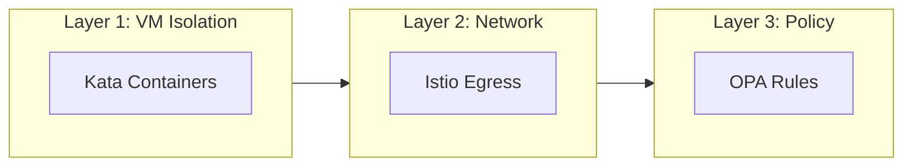

# AI Agent Sandbox on OpenShift

A hands-on workshop for securing AI agents with VM isolation, network control, and policy enforcement.

## What You'll Build

A **Currency Conversion Agent** that:
- Converts between fiat currencies (USD, EUR, GBP, JPY)
- Is blocked from cryptocurrency conversions (BTC, ETH, DOGE)
- Runs in an isolated VM (Kata Containers)
- Can only reach approved external APIs

## Workshop Modules

| Module | Persona | Duration | Description |
|--------|---------|----------|-------------|
| [00 - Introduction](00-introduction/index.md) | Everyone | 15 min | Architecture and prerequisites |
| [01 - Platform Setup](01-platform-admin/index.md) | Platform Admin | 30 min | Configure secure agent namespace |
| [02 - Agent Development](02-agent-developer/index.md) | Agent Developer | 30 min | Build and test locally |
| [03 - Deploy & Test](03-deploy-and-test/index.md) | Both | 30 min | Deploy and verify security |
| [04 - Appendix](04-appendix/index.md) | Reference | - | Troubleshooting and cleanup |

## The Three Layers of Protection



| Layer | Technology | What It Protects Against |
|-------|------------|--------------------------|
| **1. VM Isolation** | OpenShift Sandboxed Containers | Container escapes, kernel exploits |
| **2. Network Egress** | Istio ServiceEntry | Data exfiltration, unauthorized APIs |
| **3. Tool Policy** | Kuadrant + OPA | Unauthorized tool usage, crypto conversion |

## Two Paths Through This Workshop

### Path A: Full Workshop (Platform Admin + Developer)

Follow all modules in order. You'll set up the platform and then deploy agents.

```
Module 00 → Module 01 → Module 02 → Module 03
```

### Path B: Developer Only (Platform Already Configured)

If a Platform Admin has already set up the namespace, skip to Module 02.

```
Module 00 → Module 02 → Module 03
```

## Let's Get Started

👉 [Start with Module 00: Introduction](00-introduction/index.md)

