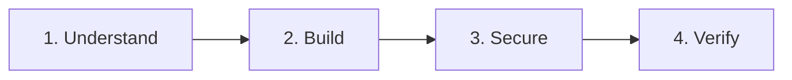

# Securing Code First Agents on OpenShift

## You've Built an AI Agent. Now What?

Your agent can convert currencies, answer questions, automate workflows. It's impressive. It's powerful.

And it's a security risk you might not fully understand yet.

**Here's what keeps agent developers up at night:**

- *"What if my agent generates code that escapes its container?"*
- *"What if a prompt injection tricks it into leaking customer data?"*
- *"What if it calls an API it shouldn't—and I'm responsible?"*

These aren't hypotheticals. They're the new reality of agentic AI.

**The good news?** There's a proven approach to deploy agents safely—and this workshop teaches you how.

---

## Why This Workshop Exists

We've seen organizations rush to deploy AI agents—only to discover too late that traditional container security doesn't work for systems that can:

- Generate and execute code at runtime
- Make autonomous decisions about which APIs to call
- Be manipulated through natural language prompts

This workshop is built on **battle-tested OpenShift technologies**:

| Layer | Technology | What It Does |
|-------|------------|--------------|
| **1. VM Isolation** | Kata Containers | Even if compromised, the agent can't escape its VM |
| **2. Network Control** | Istio ServiceEntry | Agent can only reach APIs you explicitly approve |
| **3. Tool Policy** | Kuadrant + OPA | Every tool call is validated before execution |

Each layer works independently. If one fails, the others still protect you.

---

## What You'll Build

A **Currency Conversion Agent** that demonstrates all three security layers:

| What Works | What's Blocked |
|------------|----------------|
|  Convert USD → EUR |  Convert USD → BTC |
|  Convert GBP → JPY |  Convert ETH → USD |
|  Call api.frankfurter.app |  Call any other external API |

By the end, you'll see security working—not just configured, but actually stopping unauthorized actions.

---

## The Path to Secure Agent Deployment



| Step | What You'll Do | Outcome |
|------|----------------|---------|
| **1. Understand** | Learn why agents need special security | Clarity on the threat model |
| **2. Build** | Develop and test your agent | Working Currency Agent |
| **3. Secure** | Deploy with defense in depth | Production-ready protection |
| **4. Verify** | Test that security actually works | Confidence it's locked down |

---

## What's at Stake

### Without Proper Security

| Scenario | What Happens |
|----------|--------------|
| **Container escape** | Attacker gains access to host node, other workloads compromised |
| **Data exfiltration** | Customer data sent to unauthorized endpoints |
| **Unauthorized tool usage** | Financial transactions, compliance violations, legal exposure |
| **No visibility** | You won't know something went wrong until it's too late |

### With This Approach

| Protection | What You Get |
|------------|--------------|
| **VM Isolation** | Even a kernel exploit stays contained in its own VM |
| **Egress Control** | Only the APIs you approve are reachable |
| **Tool Policies** | Every action is validated before execution |
| **Full Traces** | Complete visibility into every agent decision |

---

## Workshop Structure

| Part | Focus | Duration | Who |
|------|-------|----------|-----|
| [**Part 1: Foundations**](01-foundations/index.md) | Understand the problem and solution | 30 min | 👥 Everyone |
| [**Part 2: Inner Loop**](02-inner-loop/index.md) | Build and test your agent | 30 min | 👩‍💻 Developer |
| [**Part 3: Outer Loop**](03-outer-loop/index.md) | Deploy with security layers | 60 min | 👷 Admin + 👩‍💻 Dev |
| [**Part 4: Reference**](04-reference/index.md) | Manifests and troubleshooting | As needed | 📚 All |

**Total time:** ~2 hours

### Who Should Do What?

| Your Role | Part 1 | Part 2 | Part 3 | Part 4 |
|-----------|--------|--------|--------|--------|
| **Solo Learner** |  All |  All |  All | 📚 Reference |
| **Platform Admin** |  All | 📖 Read |  Setup + Security | 📚 Reference |
| **Agent Developer** |  All |  All |  Build + Deploy | 📚 Reference |

---

## Prerequisites

Before you start, ensure you have:

- OpenShift 4.14+ cluster with admin access
- Kagenti, Kuadrant, and OSC operators installed
- `oc` CLI installed and logged in
- Gemini API key ([Get one here](https://aistudio.google.com/app/apikey))

### Quick Verification

```bash
# Check operators are installed
oc get csv -n openshift-sandboxed-containers-operator | grep Succeeded
oc get pods -n kagenti-system | grep kagenti-controller

# Check ADK Web UI is available
oc get route adk-server -n adk-web
```

---

## Ready to Begin?

In the next two hours, you'll go from "I hope my agent is secure" to "I can prove it."

👉 **[Start Part 1: Foundations](01-foundations/index.md)**

<small>Already familiar with agent security concepts? [Skip to Part 2: Inner Loop](02-inner-loop/index.md)</small>
