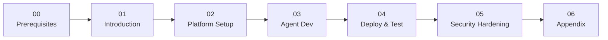

# AI Agent Sandbox on OpenShift

A hands-on workshop for securing AI agents with VM isolation, network control, and policy enforcement.

**Duration**: ~3 hours  
**Level**: Intermediate

## What You'll Build

A **Currency Conversion Agent** that:

- ✅ Converts between fiat currencies (USD, EUR, GBP, JPY)
- ❌ Is blocked from cryptocurrency conversions (BTC, ETH, DOGE)
- 🔒 Runs in an isolated VM (Kata Containers)
- 🌐 Can only reach approved external APIs

## The Three Layers of Protection


| Layer | Technology | What It Protects Against |
|-------|------------|--------------------------|
| **1. VM Isolation** | OpenShift Sandboxed Containers | Container escapes, kernel exploits |
| **2. Network Egress** | Istio ServiceEntry | Data exfiltration, unauthorized APIs |
| **3. Tool Policy** | Kuadrant + OPA | Unauthorized tool usage, crypto conversion |

---

## Workshop Flow



---

## Modules

### [Module 00: Prerequisites](00-prerequisites/index.md)
**👷 Platform Admin** • 45-60 minutes (one-time)

Install the required platform components:

- OpenShift Sandboxed Containers Operator
- Kagenti Platform (via Helm)
- Istio Service Mesh
- Kuadrant Operator

> ⏭️ **Skip if already installed** - Run the verification script to check.

---

### [Module 01: Introduction](01-introduction/index.md)
**👥 Everyone** • 15 minutes

Understand the security challenges with AI agents and the three-layer defense model.

- Why AI agents need special security
- The Currency Agent demo scenario
- Workshop overview

---

### [Module 02: Platform Setup](02-platform-setup/index.md)
**👷 Platform Admin** • 20 minutes

Configure the agent runtime environment:

- Apply KataConfig to enable VM runtime
- Create secure namespace
- Configure pipeline infrastructure for AgentBuild

> 💡 This prepares the platform. Security hardening comes after testing.

---

### [Module 03: Agent Development](03-agent-developer/index.md)
**👩‍💻 Developer** • 30 minutes

Build and test the Currency Agent locally:

- Understand the agent code (Google ADK)
- Run locally with `adk web`
- Test in the ADK Web UI
- Understand the MCP server

---

### [Module 04: Deploy & Test](04-deploy-and-test/index.md)
**🚀 Developer** • 30 minutes

Deploy the agent to OpenShift using Kagenti:

- Create AgentBuild to build from source
- Deploy Agent CR with Kata isolation
- Test currency conversions
- View traces in Phoenix

---

### [Module 05: Security Hardening](05-security-hardening/index.md)
**👷 Platform Admin** • 20 minutes

Add security layers after verifying the agent works:

- Configure Istio egress controls
- Deploy OPA tool policies
- Test blocked operations (BTC, ETH)
- Verify defense-in-depth

> 💡 **Why after deployment?** You first see the agent work, then understand what you're securing.

---

### [Module 06: Appendix](06-appendix/index.md)
**📚 Reference**

- Troubleshooting common issues
- Cleanup instructions
- Next steps and resources

---

## Who Should Do What?

| Your Role | Mod 00 | Mod 01 | Mod 02 | Mod 03 | Mod 04 | Mod 05 | Mod 06 |
|-----------|--------|--------|--------|--------|--------|--------|--------|
| **Solo Learner** | ✅ Do | ✅ Do | ✅ Do | ✅ Do | ✅ Do | ✅ Do | 📚 Ref |
| **Platform Admin** | ✅ Do | ✅ Do | ✅ Do | 📖 Read | 📖 Read | ✅ Do | 📚 Ref |
| **Agent Developer** | ⏭️ Skip | ✅ Do | 📖 Read | ✅ Do | ✅ Do | 📖 Read | 📚 Ref |

---

## Recommended Learning Path

### For Platform Admins

```
Prerequisites → Introduction → Platform Setup → Security Hardening
     │                              │                    │
     │                              │                    └── Add egress + policies
     │                              └── Configure Kata, pipelines
     └── Install operators, Kagenti
```

### For Developers

```
Introduction → Develop Agent → Deploy & Test
     │               │              │
     │               │              └── AgentBuild, Agent CR, test
     │               └── Understand code, test locally
     └── Understand security model
```

---

## Let's Get Started

👉 [Start with Module 00: Prerequisites](00-prerequisites/index.md)

Or if prerequisites are already installed:

👉 [Start with Module 01: Introduction](01-introduction/index.md)
